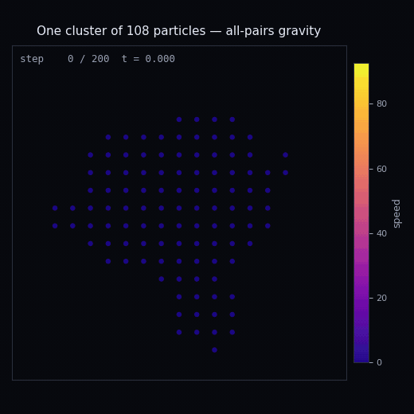
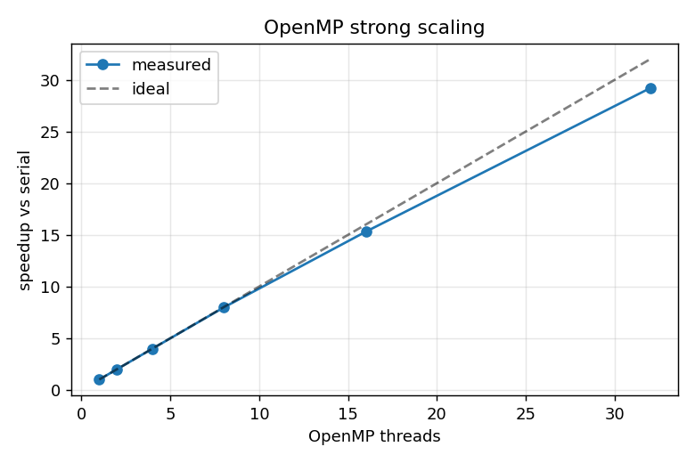
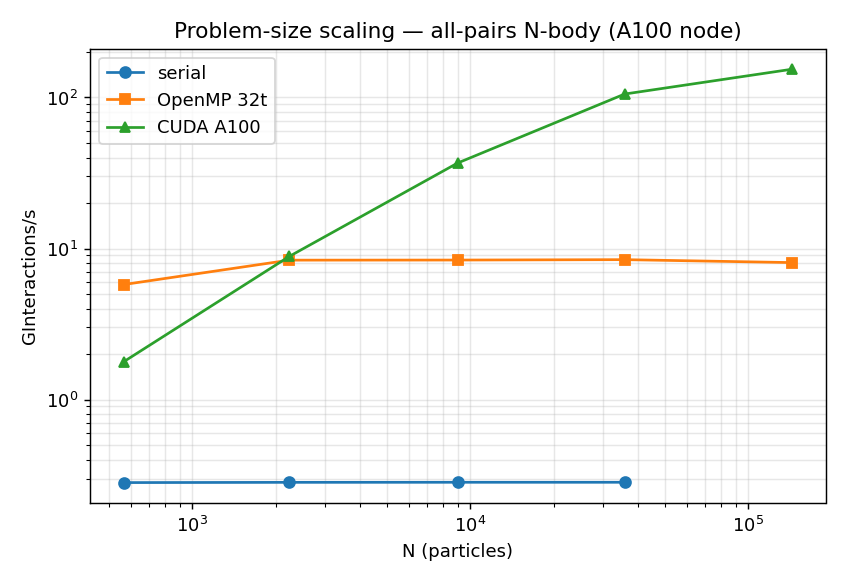
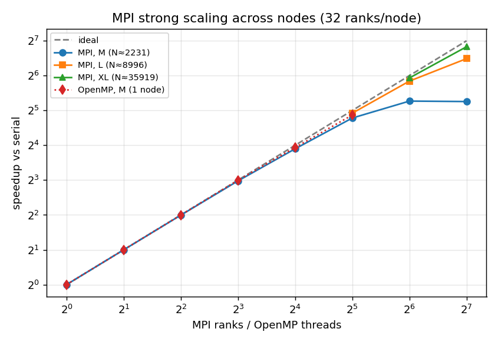

# Particle System Solver — a parallel programming study

Final project for the Politecnico di Milano PhD-school HPC course, benchmarked on the CINECA **Leonardo** supercomputer.

The solver seeds ~2,000–144,000 particles from a Mandelbrot escape-time field, then evolves them with a softened all-pairs attraction and velocity-Verlet integration. The force kernel is `O(N²)` and dominates the runtime — a clean target for parallelization.

**Goal:** take one serial reference and port it across the major parallel programming models — OpenMP, CUDA, MPI, Numba CPU, Numba CUDA — measuring what each buys on the same kernel, under a strict constraint: every port preserves the numerical model and the inner force-summation order, so results stay reproducible (bitwise-identical where the hardware allows).

<p align="center">
  
</p>

One cluster from the official run (108 of the 2231 particles), over all 200 steps, colored by speed. The particles start on the Mandelbrot sampling lattice, collapse into a dense core as the all-pairs attraction takes over, and a few slingshot out. Zooming in matters: across the full domain a particle travels only ~0.16% of the domain width, so the whole-field view looks frozen. Regenerate it with [`tools/animate_cluster_h5.py`](tools/animate_cluster_h5.py).

## Results

Measured on a Leonardo Booster node: Intel Xeon Platinum 8358 (32 cores) + NVIDIA A100-SXM-64GB, GCC 12.2, CUDA 12.2. Official input `N = 2231`, 200 steps, HDF5 output disabled.

| Implementation | Dynamics time (median) | Speedup vs C++ serial |
|---|---|---|
| C++ serial | 3.516 s | 1.0× |
| OpenMP, 32 threads | 0.120 s | **29.2×** (91% efficiency) |
| CUDA (A100) | 0.113 s | **31.1×** |
| Numba CPU | 0.128 s | 27.5× |
| Numba CUDA | 0.297 s | 11.9× |

The official size understates the GPU: at `N = 2231` the A100 is under-occupied and barely beats 32 CPU cores. The size study shows the crossover — CUDA scales to **154 GInt/s, 543× serial** at `N = 143,768`, while OpenMP plateaus at ~8.4 GInt/s:

<p align="center">
  
  
</p>

MPI (block decomposition + `MPI_Allgatherv`) extends strong scaling across nodes: **113.7× at 128 ranks** on 4 nodes (89% efficiency) for `N = 35,919`, with 92% weak-scaling efficiency at 64 ranks.

<p align="center">
  
</p>

**Correctness:** all 15 pairwise comparisons between the six course-gate implementations pass at `rtol = atol = 2e-3`. C++ serial, OpenMP, CUDA, MPI, Python, and Numba CPU produce **bitwise-identical** positions and velocities; Numba CUDA differs by at most `1.16e-3` in relative velocity.

Full evidence: [reports/summary.md](reports/summary.md) · [reports/scaling_summary.md](reports/scaling_summary.md) · [reports/mpi_summary.md](reports/mpi_summary.md) · Nsight captures in `reports/nsys/`, `reports/ncu/`.

## Implementations

| Program | Source | Execution model |
|---|---|---|
| C++ serial | `src/cpp/particles.cpp` | Reference baseline |
| OpenMP | `src/cpp/particles_omp.cpp` | Shared-memory outer-loop parallelism |
| CUDA | `src/cpp/particles.cu` | One GPU thread per particle |
| MPI | `src/cpp/particles_mpi.cpp` | Block decomposition + `MPI_Allgatherv` |
| Python | `src/python/particles.py` | NumPy reference baseline |
| Numba CPU | `src/python/particles_numba.py` | `@njit(parallel=True)` + `prange` |
| Numba CUDA | `src/python/particles_numba_cuda.py` | `@cuda.jit` kernels |

Inputs live in `input/` (size-study cases in `input/scaling/`), SLURM logs in `logs/`, and committed CSVs, plots, and profiler captures in `reports/`.

## Build and Run

```bash
python3 -m pip install -r requirements.txt

cmake --preset generic-x86-nogpu        # or: macos-arm64, generic-x86-nvidia, leonardo-a100
cmake --build --preset generic-x86-nogpu -j
```

CUDA and MPI targets build only when their toolchains are present. On Leonardo, `source scripts/env.leonardo.sh` first; on macOS, `source scripts/env.macos.sh`.

All programs share one CLI. Passing `none 0` disables HDF5 output — the benchmark mode:

```bash
./build/generic-x86-nogpu/particles_serial input/Particles.in none 0
OMP_NUM_THREADS=32 ./build/generic-x86-nogpu/particles_omp input/Particles.in none 0
mpirun -np 32 ./build/leonardo-a100/particles_mpi input/Particles.in none 0
python3 src/python/particles_numba.py input/Particles.in none 0
```

## Validation

Generate the six HDF5 outputs in `output/`, then run the full 15-pair matrix:

```bash
bash scripts/validate_all.sh            # exits nonzero if any comparison fails
```

Or compare any two files directly:

```bash
python3 tools/validate_particles_h5.py reference.h5 candidate.h5
```

On Leonardo, `bash run_validate.sh` adds strict `1e-12` checks for the pairs expected to agree bitwise.

## Reproducing the Leonardo Evidence

With the Leonardo build and virtualenv in place:

```bash
bash scripts/submit_pipeline.sh         # core correctness + benchmark jobs
sbatch submit_python_ref.sh             # needed for the full 15-pair matrix
bash run_validate.sh                    # after jobs finish, on the login node
```

MPI scaling and profiling are submitted with `run_mpi_all.sh`, `run_mpi_nodes.sh`, and `submit_profile.sh`. Regenerate the committed summaries and plots with the parsers in `tools/` (`parse_benchmarks.py`, `parse_scaling.py`, `parse_mpi.py`, `amdahl_fit.py`).

## Reproducibility Policy

Do not enable fast-math, change the inner `j` accumulation order, or introduce pair-symmetry updates without revalidating every implementation. CUDA intentionally uses round-to-nearest intrinsics to prevent contraction. Benchmark changes should record hardware, compiler flags, input size, repetitions, and whether HDF5 output was disabled.
